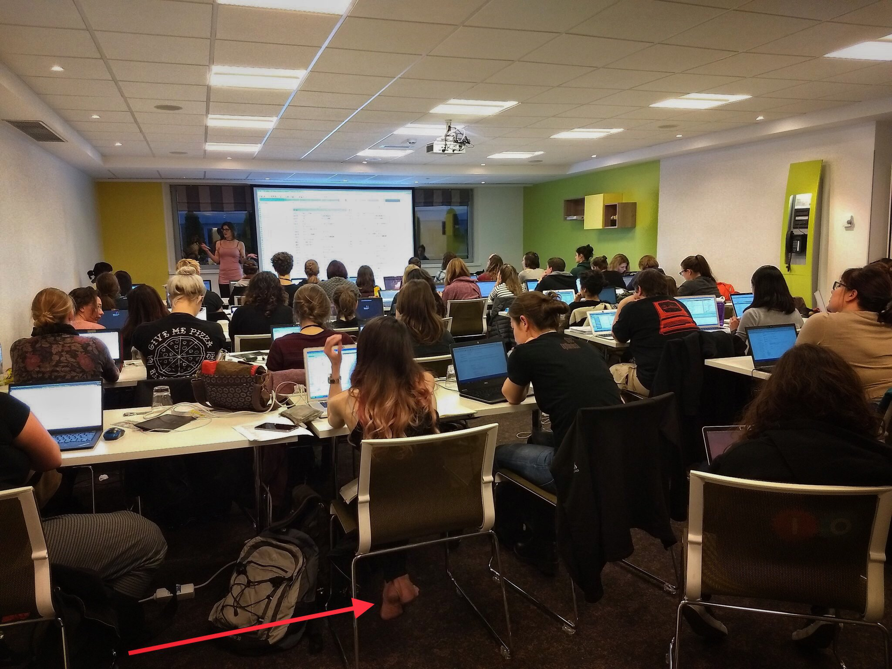
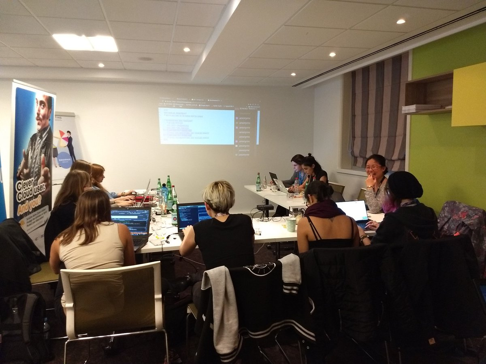

I am amazed by how this years BlackHoodie unravelled. Three days that included a pre-conference of lightening talks and two parallel tracks with a total of 64 enthusiastic members. The very spirit of BlackHoodie is nothing other than the quest to gain deep knowledge.
Reverse engineering is one of the hardest fields in security. It touches on all fields of computing, starting from assembly, programming, file formats, operating systems, networks and what not. This makes it hard but an extremely fulfilling experience to spend time learning it. For me, the very idea of staring at a binary till you understand what it does is a magical feeling.

BlackHoodie 2017 (BlackHoodie17) definitely takes the previous versions of BlackHoodie to a new level. We saw the tiny summit evolving to a mini conference in itself. And the beauty is that it is all full of young, talented, smart, intelligent women who are all going to become the future role models for women in security domain. BlackHoodie17 began with a pre-conference on Friday with a bunch of lightening talks. The talks included a wide variety of topics such as flash dumping, SMT solvers, sandbox evasion, MitM with SimTrace and so on.

From the second day, there were two different tracks. Track 1, the main track, was held by Marion. This is the beginners track for reversing where new comers are introduced to basic reversing techniques and malware analysis. The attendees are expected to start the preparations a month ago by setting up a VM and playing with the necessary tools. During the event, the first day is spent on learning basic principles of reversing as well as malware analysis. The second day is mostly into reversing a rather big binary of an IRC bot.

I did hop in and off the Track 1 at times when I really felt curious to see how they are progressing, but I was mostly into the Track 2 this year. The Track 2 included advanced reversing and many other core topics. This included topics such as ARM exploitation, deobfuscation with Miasm using Symbolic Execution, Telecommunication security, Virtualization, and Windows Kernel reversing.

I enjoyed almost all the sessions in Track 2. It was also a privilege to give a session myself. By the end of two days, I really wished that BlackHoodie was extended for one more day. It is indeed hard to explain the special feeling to be in the middle of a group of enthusiast women in security. It gave me a sense of comfort, hope and a lot of positive vibes.
The normal outcome of a 3 day conference is often tiresome after a lot of learning and socializing. But I must say that BlackHoodie17 was highly elevating and very refreshing.

I am eagerly looking forward for the next edition to take place soon.
Many thanks to all the organizers who did a lot of hard work and speakers for making this possible.

And special thanks to [Mari0n](https://twitter.com/pinkflawd) for initiating such a great event.  

-- [Priya](https://twitter.com/priyachalakkal)

You can find some of the material of #BlackHoodie17 [here](../archive/)
