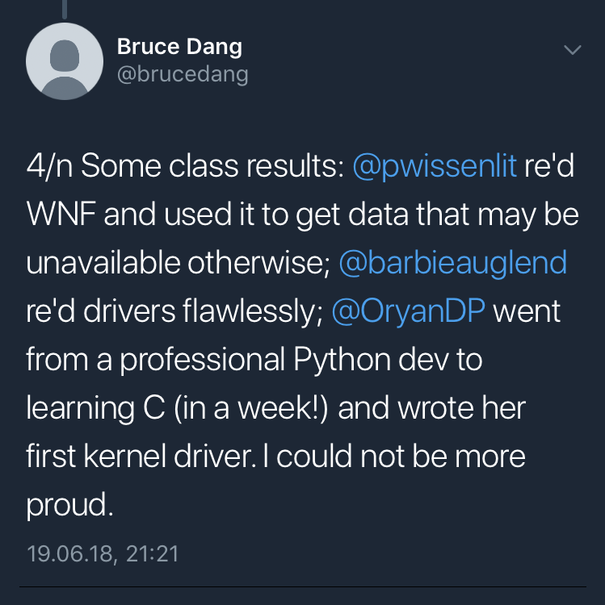

Both: We are not good at expressing ourselves but sometimes we do want to convey things that are important to us. And during the past months, some marvellous events happened that finally lead us to write this super massive (and a bit awkward) post! :)

[Gwaby](https://twitter.com/pwissenlit) : Don't laugh at me, but sometimes I like to think that we are all in a tabletop RPG. We all have a character sheet where skill points are added when we learn new stuff and we roll a dice whenever an event occurs. I think we got an epic win on the dice roll the very moment we met Bruce Dang. Either this or we min/maxed our luck points when we were young, I don't know.

  <a href="https://twitter.com/barbieauglend">barbie</a> : We so got a 20 each!

Both: Bruce is a very great reverser who is currently working at Veramine and was previously a developer for Microsoft. If you ever read Practical Reverse Engineering, you already know him as he is one of the co-authors.
A few months ago, he invited five ladies from BlackHoodie to attend his training at Recon Montreal. Priya, Oryan, Aneal and both of us were the lucky ones attending it. It goes without saying that no one in our tiny group could afford such training otherwise as these events are especially expensive. Still, Bruce graciously offered seats for free!

We knew him by name for a long time and everybody we know had already told us he is awesome but - we are not kidding - this man is probably the most genuinely kind and humble person we have ever met!

And his training was so cool! It was really intense as we went through a lot of low-level concepts related to the Windows Internals. At the end of the week, we were all able to reverse or even develop rootkits for Windows. Not only this, we had a fair overview of the internals and we could dig into them without issues.

Two exercises were particularly entertaining for us: (ab)using the WNF and analyzing a not so common rootkit.

[Gwaby](https://twitter.com/pwissenlit) : I already had some knowledge about the Windows kernel and I was really interested in learning more about it. Therefore, I focused on the first one.

The WNF (Windows Notification Facility) is a component used to dispatch notification across the system. A consumer (either a userland application or a kernel module) can subscribe a specific "event" and be notified every time this event happens. On the other side, another component publishes data that will be sent to the subscribers when they got notified. The goal here was to reverse several (undocumented) kernel functions and use them to get information about who is using the microphone.

> If you are interested and want to know more about it, please have a look at Bruce's blog post: [https://gracefulbits.com/2018/08/13/find-which-process-is-using-the-microphone-from-a-kernel-mode-driver/](https://gracefulbits.com/2018/08/13/find-which-process-is-using-the-microphone-from-a-kernel-mode-driver/)

I really enjoyed this practical work as I discovered a component I didn't know at all and which is really fun to play with. It was so interesting that I continued to reverse it way after the end of the training in order to understand its mechanics.

  <a href="https://twitter.com/barbieauglend">barbie</a> : And I went for the rootkit exercises. He mentioned, we would be reversing something complex and, even though it was from an unfamous threat actor, there wasn't many write ups about that specific sample. So, I needed to try it out myself :) For me it was a surreal experience! While reading the code I started seeing things happening there, that for me were like "why would someone do that?"... I was so unsure about the code, that I started thinking, I can not read assembly code at all - until Bruce came to me and said "No, you are right, they are doing exactly what you just said..."

After half of day staring at that sample, I had my answer: I was reversing one of the Equation Group drivers - and it was SO EXCITING! The techniques I learned there and the assurance I got from him, pushed me to do the kind of work I am doing now - tbh I was scared as hell and I was sure, the job is not for me, as I am not good enough for that and guess what, here I am now - thanks to him!

> If you want to know more about Rootkit analysis, don't miss one of his open trainings: [https://gracefulbits.com/training-courses/](https://gracefulbits.com/training-courses/)

[Gwaby](https://twitter.com/pwissenlit) : And this is not the end! At that time, I was already super happy and thankful to Bruce for such a great content in his training. But the best was yet to come for me: At Recon, Bruce introduced me to Alex Ionescu. Basically, all the stuff I'm working on so far are based on his publications. This is one of the main references in the Windows Internals field and a researcher I truly respect. I was able to discuss with him about the WNF and he asked me if I was interested on presenting the component with him. I still cannot believe this, but it really happened: I was on the same stage as Alex at BlackHat USA this year! It was an rewarding experience. It gave me confidence about what I was able to do and, of course, I learned a lot while working with him.

  <a href="https://twitter.com/barbieauglend">barbie</a> : Same for me, but for another reason / person! Bruce introduced me to Rolf Rolles and I couldn't even breath. When I first started playing with binaries, I wanted to mix the things I did before with security and binary analysis. The "things I did before" were all Logic / SMT Solvers related and his tutorials were kind of the basic knowledge I used for my very first tool (a small parser for Jasmin). Since then, I have been developing more SMT solvers based tools for binary analysis and keep following his work as an inspiration!

Both: And all of this is thanks to Bruce. In the end, not only did he gave us access to a great amount of highly technical knowledge by inviting us to his training but he also introduced us to people we would have probably never ever dared to speak with and that is priceless.
While we are still at the beginning of our journey, we got the feeling that we are one tiny step closer to our goal to be great reverse engineers and that really rocks. We are always going to be grateful to him for that and that's why we wanted everyone to know how cool he is. :)

Both: And hey, while you are still reading, there is actually another person we would like to speak about! If you don't mind, we will hijack a lil bit more of your time for her because she deserves it. ;P

We wouldn't be here, writing this awkward post together if pinkflawd hadn't started BlackHoodie in the first place.

To tell you all the story, a few years ago we never thought it was possible for us to be reversers. It's not like we were not interested but for some reasons we unconsciously built an invisible wall saying it wasn't for us and we weren't good enough. We were probably afraid of failing and getting out of our comfort zone.

Then, we saw her blog posts: she was inviting ladies to come and have fun with malware for a weekend: that was the first and second BlackHoodie events. So we respectively packed our things and went to meet her. She was so nice and we all had a great time working on those binaries! It was awesome!! She basically crushed this invisible wall we have built and pushed us to start reversing for real.

[Gwaby](https://twitter.com/pwissenlit) : She even pushed me to meet my current boss (for the record, before joining his company, I was totally sure it was out of reach).
In this company, I met amazing co-workers. They taught me all I know about Windows Internals. I never have touched kernel stuff before but it was so fun! I liked it so much and totally wanted to see more!! I finally have found the kind of job I want to do and I would have totally missed it if it wasn't for pinkflawd.

Both: So yeah, if we can say we are happy at work, it's all thanks to one lady that wanted to see more women in this field.

We get asked quite often, why we are part of BlackHoodie and why this bootcamp exist in the first place. If you're truly interested in a field, you don't need anyone to start digging into it, do you? Yeah, probably not... But sometimes, one still needs a little push in the back to start rocking and that's BlackHoodie's purpose, <a href="#opinion">in our opinion.</a>

For us, this is a place that gives confidence when it's needed, where we can be stronger on our own way. It's not about tending each other wounds because the big bad world is mean, it's about pushing each other further so we can grow and be badass together. And trust us, we're all so on the way to become badass. ;)

Pinkflawd succeeded in creating such a space and that's why we are so thankful to her.

----

<small>This is <i>our (gwaby and barbie)</i> personal point of view. We don't and won't speak for the others: we are all different.</small>

